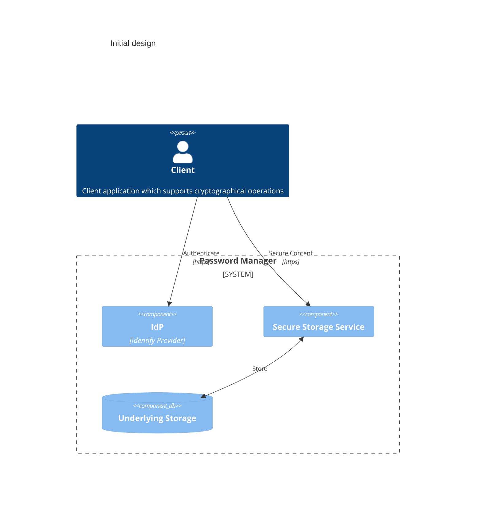
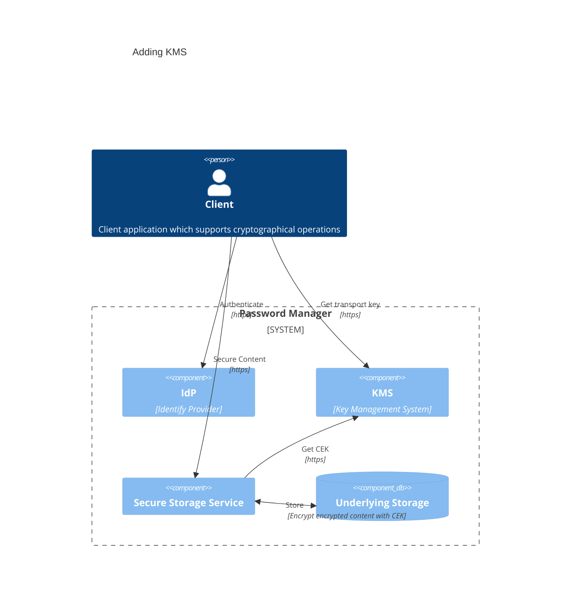

Initial Component
=================

Let's start thinking about the big picture of the entire solution.
The application should be used over the Internet. So mustn't be a 
standalone application. This means, the application must have an
[IdP](./glossary.md#IdP) to authenticate users. Now, we need to 
store the secure contents somewhere, so it has to have Secure 
Storage Service, [SSS](./glossary.md#SSS), as well. Then we also
need a client which can do some cryptographical operations, at
least supporting [KDF](./glossary.md#KDF). As the application mustn't
be a standalone application, it's good it to be a web application.
So, all the network traffic must be done on HTTPS. Now we can see
a big picture of the application.

The client derives [CEK](./glossary.md#CEK) from the master password
by using [KDF](./glossary.md#KDF). And send it to the [SSS](./glossary.md#SSS).
Even the network traffic is eavesdropped, the attacker can't decrypt
the content. So, it's secure, right? According to the study[^1],
average password entropy is 40 bits. Suppose, a CPU can test one million
decryption in a second. With 40 bits key, the key space is 
$2^40 = 1099511627776$, one million is about $2^20$, so the brute force
can be done in $2^40/2^20=1048576$ seconds, which is about 12 days.

12 days is not long enough to feel safe. This means, in case of 
data breach, the secure content itself needs to encrypted by a different
key, a transport key. Then we need a Key Management System 
([KMS](./glossary.md#KMS)) as well. Usual setup of 
[KMS](./glossary.md#KMS) can be, having a master key, then Key 
Encryption Key ([KEK](./glossary.md#KEK)), working keys which can
be used by the [KMS](./glossary.md#KMS) users. The master key is 
usually stored in [HSM](./glossary.md#HSM), then 
[KEK](./glossary.md#KEK)s are wrapped by the master key and stored in
a database.

Obviously, the users also know their transport key otherwise they can't
encrypt their encrypted content. This means, if a malicious user cracked
into the [SSS](./glossary.md#SSS), they might be able to decrypt other
users' encrypted secure contents as well. To prevent this, we need
another key to store the encrypted secure content and make the transport
key temporary so that reusing the key may not be possible. To do so,
the application needs to some key agreement without any prior knowledge
of the key material. 

Incorporating with the above consideration, the diagram should look
like this:

[^1]: [A Large-Scale Study of Web Password Habits](https://rist.tech.cornell.edu/6431papers/FlorencioHerley2007.pdf)
