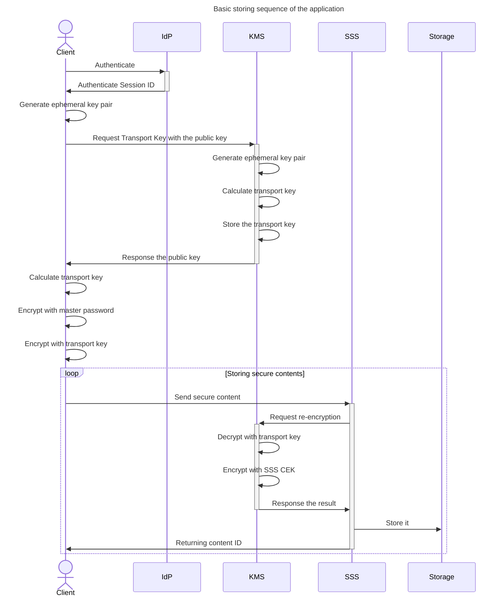
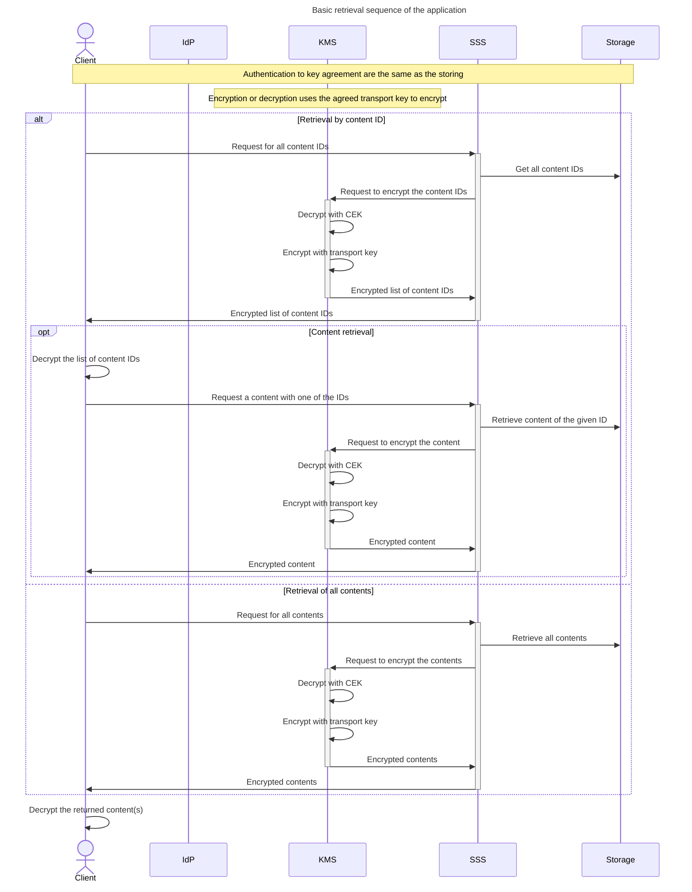

Initial Sequence
================

We've designed the initial components, now we need to design
the operation sequence. The first step is always easy, a user
get authenticated. Once the user is authenticated, then the
user needs to get a transport key. A transport key is a secret
key which needs to be shared by both the application and the user.
Then the user can send their secure contents, which is first
encrypted by a key derived from the master password then encrypted
by the transport key, to [SSS](./glossary.md#sss). Now, the sequence
of storing secure contents should look like this:

After a secure content is stored, then retrieval of the content
must also be possible. Though, [SSS](./glossary.md#sss) doesn't 
have any knowledge of the contents, unless the owner and content
ID, querying contents by search criteria is not possible. Thus,
the only ways it can provide are giving the list of content IDs,
returning all contents, and searching by content ID. So, the
retrieval sequence should look like this:

As the storing sequence, stored secure contents are encrypted
by [SSS](./glossary.md#sss)'s [CEK](./glossary.md#cek), so 
[KMS](./glossary.md#kms) must decrypt with it then encrypt 
with the transport key.
