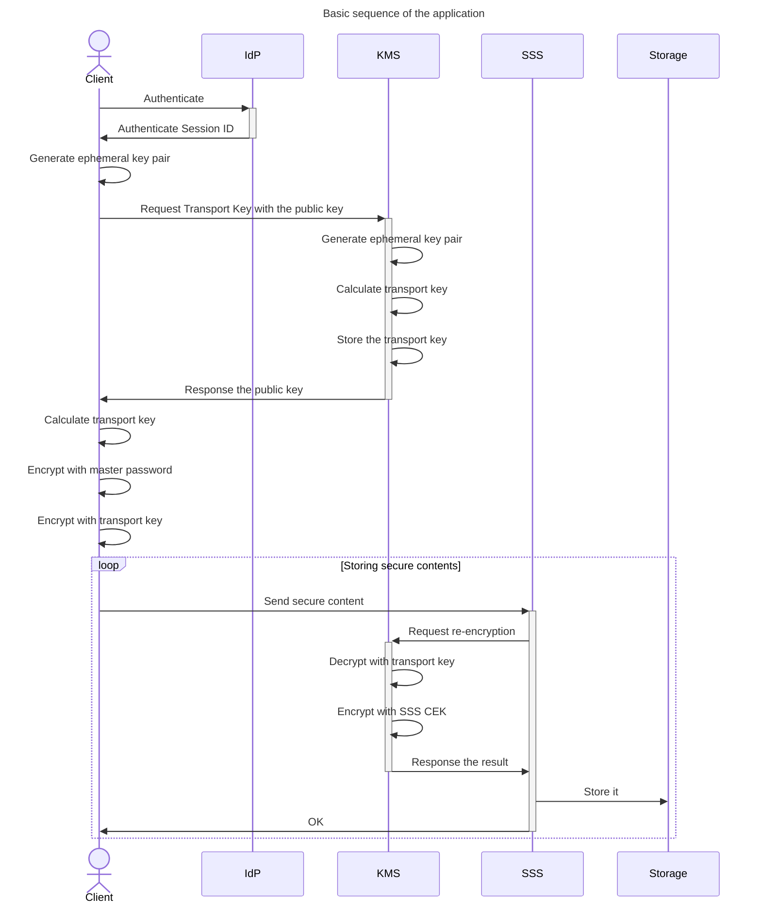

Initial Sequence
================

We've designed the initial components, now we need to design
the operation sequence. The first step is always easy, a user
get authenticated. Once the user is authenticated, then the
user needs to get a transport key. A transport key is a secret
key which needs to be shared by both the application and the user.
Then the user can send their secure contents, which is first
encrypted by a key derived from the master password then encrypted
by the transport key, to [SSS](./glossary.md#sss). The sequence
should look like this:

